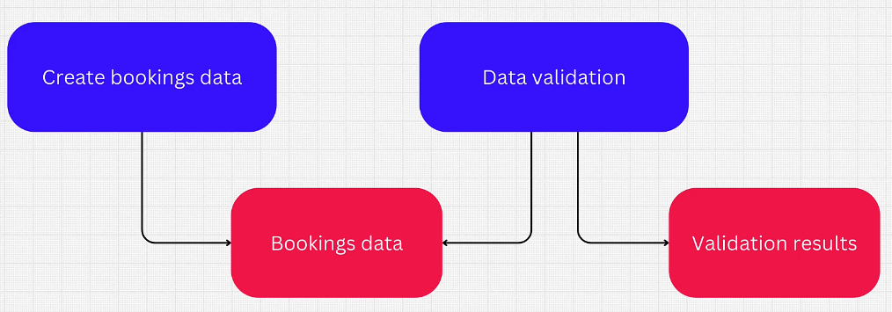

<p align="center">
  
</p>


# 1. Apache Airflow: The Orchestrator of Your Data Workflows 🏗️

Apache Airflow is a robust platform designed to programmatically author, schedule, and monitor workflows. At its core, Airflow is all about managing *tasks* and their dependencies to build complex data pipelines.

## What is a Task? 🤔

In Airflow, a **task** is the fundamental building block of any data pipeline. It represents a *single, atomic action* that needs to be performed. Think of it as a step in a recipe.

### 💡 Common Task Capabilities

Tasks are incredibly versatile and can perform a wide array of operations:

*   **📊 Data Ingestion:** Reading data from databases, APIs, or other external sources.
*   **✨ Data Transformation:** Running Spark jobs, executing Python scripts for data cleaning or aggregation.
*   **📦 Data Loading:** Writing processed data into external databases, data warehouses, or data lakes.
*   **📧 Notifications:** Sending emails or Slack messages upon completion or failure.

## Task Dependencies: Defining the Flow ➡️

The power of Airflow comes from its ability to define **dependencies** between tasks. These dependencies explicitly dictate the *order of execution*.

For example:
*   If *Task B* depends on *Task A*, then *Task A* must complete successfully before *Task B* can even begin.


If a task fails, any tasks that depend on it will not be executed.


## The Graph of Tasks: Your Pipeline's Blueprint 🗺️

A collection of tasks, along with the dependencies that connect them, forms a **graph**. In computer science, a graph is a way to represent a network of interconnected entities. This network visually illustrates the sequence and relationships between your tasks.
  
## Introducing the DAG: Directed Acyclic Graph 📈

The network of tasks in Airflow is formally known as a **Directed Acyclic Graph**, or **DAG** for short. You'll encounter this term frequently in Airflow's UI and documentation. Let's break down what each part signifies:

*   **Graph:** As we discussed, this is the network of tasks and their connections.
*   **Directed:** The connections between tasks have a specific **direction**. For instance, Task A might feed into Task B (Task B depends on Task A), but Task A does not depend on Task B. The flow is one-way.
*   **Acyclic:** This is a critical constraint! It means that **cycles are strictly forbidden** within the graph. You cannot create a situation where Task A depends on Task B, and Task B simultaneously depends on Task A. Airflow ensures that your workflows always have a clear start and end.

Essentially, a DAG serves as a **template for a set of steps you want to repeat periodically in a particular order.** Airflow takes this template and automates its execution.

### ⏰ DAG Scheduling

DAGs are typically designed to run on a schedule:
*   **Daily** ☀️
*   **Hourly** ⏱️
*   **Minute-by-minute** (highly configurable!)

**Important Note:** By default, individual runs of the same DAG are independent. Dependencies only exist *between tasks within a specific DAG run*.


## How Airflow Executes a DAG ⚙️

Once you've defined a DAG, Airflow meticulously executes it through a well-defined process:

1.  **Identify Initial Tasks:** Airflow first identifies and executes tasks that **have no upstream dependencies**. These are the starting points of your workflow.
2.  **Execute Dependent Tasks:** Upon successful completion of the initial tasks, Airflow looks for tasks whose **all dependencies have been satisfied**. These tasks are then scheduled for execution.
3.  **Continuous Process:** This iterative process continues until **all tasks in the DAG are successfully executed**.
4.  **Handling Failures:** By default, if any task fails, Airflow will **not start any downstream tasks that depend on the failed task**. This prevents cascading failures, though this behavior is configurable to allow for retries or different error handling.

### 🧑‍💻 Defining a DAG

To define a DAG, you simply create a Python file (`.py`) and place it in a designated folder that Airflow monitors. When Airflow detects this new file, it parses the Python code, instantiates the DAG object, and makes it available for scheduling and execution.

**Crucial Distinction:** Airflow is an *orchestrator*, not a data processing framework. It doesn't process data itself; instead, it tells other systems (like Spark, Python scripts, databases) *when* and *in what order* to process data. Airflow is designed for **batch processing** and does not natively support streaming data workflows.


---

# 2. Airflow's Architecture: The Engine Behind Your Pipelines 🛠️

Airflow's robust architecture comprises several interconnected core components that work in harmony to manage, schedule, and execute your data pipelines.


Here’s a breakdown of the key components:

## 1. Scheduler ⏰

The **Scheduler** is the brain of Airflow. It continuously monitors all registered DAGs and tasks to determine what needs to run and when.

### 🔑 Key Responsibilities:

*   **Dependency Evaluation:** Constantly checks if task dependencies are met.
*   **Task Scheduling:** Submits tasks that are ready to run to the executor.
*   **Retry Management:** Handles task retries based on configured policies if a task fails.
*   **DAG Discovery:** Reads DAG definition files from a specified folder (where engineers place their DAGs) to discover new or updated workflows.

## 2. Webserver (User Interface & API) 🌐

The **Webserver** provides the crucial interface for users and external systems to interact with Airflow.

### 🌟 Features:

*   **User Interface (UI):** A rich, interactive web interface for:
    *   Visualizing DAGs and their status.
    *   Monitoring task progress.
    *   Managing connections, variables, and configurations.
    *   Triggering DAGs manually.
    *   Viewing logs.
*   **API:** Provides a programmatic interface to interact with Airflow, enabling automation and integration with other tools.


## 3. Metadata Database 🗄️

Airflow relies on a persistent **Metadata Database** to store all operational information. This is a critical component for Airflow's statefulness.

### 💾 What's Stored Here?

*   **DAG & Task Execution History:** Records of every DAG run, task instance status, and execution logs.
*   **Users & Permissions:** Information about Airflow users and their roles/permissions.
*   **Connection Configurations:** Securely stored credentials and connection details for external systems (databases, cloud services, etc.).
*   **Variables:** Key-value pairs that can be used to store configuration values accessible within DAGs.

### 🛠️ Common Database Options:

*   **SQLite:** A lightweight, file-based database.
    *   *Usage:* Primarily for local development and testing environments. Not recommended for production.
*   **PostgreSQL:** A powerful, open-source relational database.
    *   *Usage:* **Highly recommended** and widely used for production Airflow deployments due to its robustness and scalability.
*   **MySQL:** Another popular open-source relational database.
    *   *Usage:* Also a strong candidate for production environments.

## 4. Executor 🚀

The **Executor** is the component responsible for actually *running* your tasks. The scheduler delegates tasks to the executor, which then determines *where* and *how* these tasks will be executed.

### 🌍 Where Tasks Run:

*   **Locally:** Tasks can be run on the same machine as the scheduler.
*   **Distributed:** For larger deployments, tasks can be offloaded to a separate set of worker machines, providing scalability and isolation.

### 📋 Available Executor Implementations:

Airflow offers a variety of executors to suit different operational needs:

*   **Sequential Executor:**
    *   Runs tasks *one by one*, locally.
    *   *Best for:* Local development, testing, and debugging. Not suitable for concurrent production workloads.
*   **Local Executor:**
    *   Can run tasks *concurrently* on the same local machine.
    *   *Best for:* Local development and testing where some parallelism is desired.
*   **Celery Executor:**
    *   Leverages **Celery**, a distributed asynchronous task queue.
    *   *Best for:* Scaling task execution across multiple worker nodes. Ideal for medium to large-scale deployments.
*   **Kubernetes Executor:**
    *   Utilizes **Kubernetes**, a container orchestration platform.
    *   *Best for:* Dynamic resource allocation, running each task in its own pod, and robust scaling in cloud-native environments.
*   **Dask Executor:**
    *   Integrates with **Dask**, an open-source Python library for parallel computing.
    *   *Best for:* Leveraging Dask clusters for high-performance parallel task execution, especially for Python-centric workloads.

### ⚙️ Configuration:

The chosen executor is specified in the Airflow configuration file (typically `airflow.cfg`) using the `executor` parameter:

```ini
[core]
executor = LocalExecutor  # or CeleryExecutor, KubernetesExecutor, etc.
```


# 3. Idempotent Tasks: Ensuring Reliable Reruns 🔄

When building robust data pipelines with Apache Airflow, one of the most critical concepts to master is **idempotence**. An *idempotent task* is designed to produce the **same result every time it is executed, regardless of how many times it runs.**

### Why is Idempotence Crucial in Airflow? 🎯

Airflow workflows are dynamic, and tasks might need to be rerun for various reasons:

*   **Task Failures:** A task might fail due to transient issues, requiring a retry.
*   **Bug Fixes:** A bug discovered in a task necessitates a rerun to correct historical data.
*   **Backfilling:** Running a DAG for past dates to process historical data.

In all these scenarios, an idempotent task guarantees *consistency* and *correctness* by ensuring that rerunning a task for a specific logical execution does not introduce side effects or alter previously correct outputs.

### Example: Daily User Bookings to S3 📦

Let's illustrate idempotence with a common scenario:

**Scenario Description:**
Imagine you have an Airflow DAG with a task that runs *daily*. Its primary function is to:

1.  **Read Data:** Extract user bookings from a database specifically for a *particular day*.
2.  **Write Data:** Store these daily bookings into a dedicated file within an **S3 bucket**.
3.  **Output Goal:** Each daily run should produce a *new file in S3*, containing only the bookings placed on that specific day.

**The Challenge: Rerunning a Historical Task**

Consider the task that was originally scheduled and executed for **November 23rd, 2025 (23/11/25)**.

*   If this task initially failed, or a bug was found and fixed, you would need to **rerun it**.
*   When rerunning, the task *must* behave exactly as it did on its original run: it should read data *only for November 23rd, 2025*, and write the results to the *same designated S3 location* for that day.

### 🚫 Non-Idempotent Implementation (The "Bad DAG" Anti-Pattern)

A common pitfall is to make tasks non-idempotent by relying on the system's `current_time`.

*   **The Problem:** If the task's logic uses `current_time` to determine which day's data to process, it becomes non-idempotent.
*   **Example:** If the task for *November 23rd, 2025*, fails and you rerun it two days later (e.g., on *November 25th, 2025*), `current_time` would incorrectly point to November 25th. This means the rerun would fetch and process data for the *wrong day*, leading to inconsistent results and failing to correctly reproduce the original November 23rd output. The task's behavior would change depending on the actual calendar date of its execution, rather than its intended logical date.

### ✅ Idempotent Implementation (The Correct Approach)

Airflow provides powerful mechanisms to make tasks idempotent by allowing them to "pretend" they are running on a specific **logical or execution date**, regardless of the actual wall-clock time of the rerun.

#### For Python Tasks: Utilizing `execution_date` 🐍

When writing custom Python code for your tasks, Airflow offers a special context variable: **`execution_date`**.

*   **How to Access:** You can retrieve this `execution_date` using the `get_current_context` function provided by Airflow. This function returns a dictionary containing important information about the current task's execution.
*   **Usage:** Your task's logic should *always* use the `execution_date` to determine the specific day for which it should process data and generate output. This ensures that even if a task for November 23rd, 2025, is rerun days later, it will still process data specific to November 23rd, 2025.


### Visualizing Idempotence 🖼️

The image below vividly illustrates the concept of idempotent tasks in action. 


<p align="center">
  
</p>


*   **Task 22/11/25:** Successfully ran and produced a file named `22/11/25` in S3.
*   **Task 23/11/25:** Is shown with a "Rerun/Retry" icon. This indicates that it might have failed initially or was rerun for other reasons. Crucially, even on a rerun, it correctly operates on and targets the file `23/11/25` in S3. It does not accidentally process data for a different day.
*   **Task 24/11/25:** Successfully ran and produced a file named `24/11/25` in S3.

This visual confirmation highlights that regardless of how many times a task for a specific logical date (like 23/11/25) is executed, it will *always* work with and produce output for *that exact date*, ensuring the integrity and consistency of your data pipelines.

---

## Average Page Visits DAG 📊

### Overview
A simple Airflow DAG that generates sample property page visit data and calculates the average visits across listings.

### Configuration
- **Schedule:** Every minute (`* * * * *`)
- **Catchup:** Disabled
- **Start Date:** September 2, 2025

### Tasks
1. **`produce_page_visits_data`** - Generates random page visit data and saves to timestamped JSON file
2. **`process_page_visits_data`** - Reads data and calculates average page visits

### Key Features
- Sequential task execution using `>>` operator
- Idempotent design with `execution_date` for consistent file naming
- Demonstrates basic ETL workflow pattern


This DAG serves as an introduction to Airflow task dependencies and data processing workflows.

---

## Data Quality Pipeline DAG 🔍

### Overview
A data validation DAG that generates sample booking data with intentional quality issues and then validates the data to identify anomalies.

### Configuration
- **DAG ID:** `data_quality_pipeline`
- **Schedule:** Every minute (`* * * * *`)
- **Catchup:** Disabled
- **Start Date:** September 2, 2025

### Tasks
1. **`generate_bookings`** 📝
   - Creates 5-15 random booking records with 70% probability of valid data
   - Intentionally introduces missing fields and invalid values
   - Saves data to timestamped JSON file in `/tmp/data/bookings/`

2. **`quality_check`** ✅
   - Validates generated booking data against quality rules
   - Identifies missing required fields and invalid status values
   - Saves validation results to `/tmp/data/anomalies/`

### Key Features
- **Data Quality Simulation:** Uses `CORRECT_PROB = 0.7` to simulate real-world data quality issues
- **Comprehensive Validation:** Checks for missing fields and invalid status values
- **Anomaly Reporting:** Generates detailed reports of data quality issues found
- **Sequential Processing:** Data generation → validation workflow



This DAG demonstrates data quality monitoring patterns essential for production data pipelines.


---

# 4. Spark with Airflow: Orchestrating Big Data Workflows 🚀

Integrating Apache Spark with Apache Airflow is a common and powerful pattern for building scalable data pipelines. Airflow takes on the role of the orchestrator, while Spark handles the heavy lifting of large-scale data processing.

## 4.1 Offloading Data Processing to External Resources 🌐

While Airflow is excellent for scheduling and managing workflows, it's crucial to understand its limitations regarding direct data processing.

### 💡 Understanding the Need for External Processors

*   **Airflow's Scalability Limit:** Standard Python tasks running directly on Airflow workers are **not designed for large-scale data processing**. Attempting to process massive datasets within these tasks will lead to performance bottlenecks and inefficiencies, as Airflow workers are typically optimized for orchestration, not distributed computation.
*   **The Power of Distributed Processing:** For processing **large volumes of data efficiently and at scale**, a dedicated distributed processing framework like Apache Spark is indispensable. Spark's architecture allows it to distribute computation across a cluster of machines, dramatically accelerating processing times.

### 🤝 Ideal Division of Labor

The synergy between Airflow and Spark lies in a clear separation of concerns:

*   **Spark's Role:** Spark applications are responsible for the core data manipulation. This includes:
    *   **Reading** raw or staged input data.
    *   **Processing** the data (transformations, aggregations, machine learning).
    *   **Writing** the processed results to persistent storage (e.g., S3, data warehouses).
*   **Airflow's Role:** Airflow acts purely as an **orchestrator**. Its job is to:
    *   **Manage** the end-to-end workflow.
    *   **Trigger** Spark applications at the right time.
    *   **Monitor** the status of Spark jobs.
    *   **Handle dependencies** between data-processing stages.

Here's a visual representation of Airflow orchestrating Spark: 


### 🔌 Integrating with the `SparkSubmitOperator`

To facilitate this integration, Airflow provides specialized operators. The most common one for triggering Spark jobs is the **`SparkSubmitOperator`**. This operator allows your Airflow DAGs to submit Spark applications to a Spark cluster.

## 4.2 Example Data Pipeline Integration 📊

Let's walk through a concrete example of how Airflow orchestrates a Spark job to process booking data.

Here's an illustration of the pipeline: 


**Pipeline Steps:**

1.  **Extract Data (Airflow Task):**
    *   An Airflow task is responsible for connecting to a **PostgreSQL database** and periodically extracting raw reservation (booking) data.
    *   *This task uses Airflow's capabilities for database connectivity and scheduling.*

2.  **Stage Data (Airflow Task):**
    *   Following extraction, the Airflow task writes the newly read booking data to a **file system** (e.g., an S3 bucket or HDFS). This makes the data accessible as input for the next stage.
    *   *Airflow ensures data is prepared and staged correctly before handing off to Spark.*

3.  **Trigger Spark Job (Airflow with `SparkSubmitOperator`):**
    *   Once the booking data is staged, Airflow triggers a **Spark job**. This is typically done using the `SparkSubmitOperator`.
    *   The Spark job's first action is to **read the staged booking data** from the specified file system.

4.  **Data Transformation with Spark:**
    *   Within the Spark job, the powerful distributed processing capabilities are unleashed:
        *   The booking data is **joined with listings data** (which might also be read from a file system or another source).
        *   Finally, Spark computes aggregations, such as the **total number of reservations per listing**.
    *   The aggregated results are then written back to a designated storage location by Spark.


# 5. 🎈 Airflow Sensors: Bridging External Data Gaps 🌉

Airflow is a powerful orchestrator, but what happens when your data lives *outside* its direct control? That's where **sensors** come in!

## 🎯 Purpose of Airflow Sensors

A frequent challenge in data orchestration is that **you can't run everything within Airflow itself**. While Airflow excels at managing tasks that consume data produced by other Airflow tasks, it faces a hurdle when **data is produced by external services outside of Airflow**.

*Imagine this scenario:* Your Airflow DAG needs to process data generated by an external system. If your dependent tasks start before this external data is ready, they will inevitably fail or produce incorrect results.

**Sensors act as a crucial bridge** 🌉 in these situations, allowing Airflow to intelligently wait for external conditions to be met before proceeding with downstream tasks. They prevent premature task execution and ensure data readiness.


## ⚙️ How Sensors Work

At their core, sensors are nothing more than **regular Airflow tasks**. Their primary function is to **wait for a particular condition to be met**.

*   **Waiting Game**: A sensor task starts and continuously checks for a specific external condition.
*   **Condition Met!** ✅: Once this condition is satisfied, the sensor task successfully completes.
*   **Go Time!** 🚀: This success then signals to any tasks that depend on it that they can now be executed.

## ### Example of Sensor Usage: File Sensor Operator

Let's look at a concrete example: the `FileSensor` operator. This sensor is specifically designed to wait for a file to appear on a given file system.

To configure the `FileSensor` operator, you typically need to provide the following parameters:

*   **File System ID**: 🆔 An ID of the file system to be used. (Configuration details for file systems are usually handled separately in Airflow connections).
*   **File Path**: 📁 The exact path to the file that the sensor needs to monitor.
*   **Poke Interval**: ⏳ How often the sensor should *check* for the existence of the file (e.g., every 5 seconds).
*   **Timeout Period**: ⏱️ (in seconds) If the file is not found within this specified timeout, the sensor task will fail, preventing the downstream tasks from running indefinitely.

## 🧠 Sensor Modes: Poke vs. Reschedule (The "Gotcha" ⚠️)

Sensors in Airflow have an important "gotcha" concerning how they operate, specifically in one of two modes: `poke` vs. `reschedule`. Understanding this is critical for efficient Airflow operations.

### 🕵️‍♂️ Poke Mode

*   **Long-Running Task**: In `poke` mode, a sensor task **runs for a long duration of time**, continuously and periodically checking its target condition.
*   **Worker Slot Occupancy**: The significant issue here is that a sensor in `poke` mode **occupies a worker slot for the entire duration of its process**. This continues until either the condition it's waiting for is met, or the sensor reaches its timeout.
*   **Resource Saturation**: This can lead to severe problems with task scheduling. For instance, if a sensor in `poke` mode takes a long time, and Airflow launches subsequent DAG executions for different timestamps, new sensors from these executions will start occupying more worker slots. This can eventually lead to sensor tasks **occupying all available worker slots**, preventing Airflow from scheduling any more tasks. This is a common cause of DAGs getting stuck! 🚫

### 🔄 Reschedule Mode

*   **Efficient Alternative**: This is an alternative and significantly more efficient mode.
*   **Temporary Slot Occupancy**: In `reschedule` mode, the sensor **occupies a worker slot only for the duration of a single check**. Instead of holding the slot for potentially hours, it releases it between checks.
*   **Worker Slot Release**: If the condition is not met, the sensor *yields* and *reschedules* itself to run again after its `poke_interval`, freeing up the worker slot in the meantime.
*   **Prevents Saturation**: This mode effectively helps prevent the worker slot saturation problem seen with `poke` mode, making your Airflow environment more robust and scalable. ✨

---

# Airflow DAGs Analysis Summary

## DAG Files Overview

| File Name | DAG ID | Main Purpose | Schedule | Dependencies | Spark Script Used |
|-----------|--------|--------------|----------|--------------|-------------------|
| `01-average_page_visits.py` | `average_page_visits` | Generate and process page visits data for property listings | Every minute | None | None |
| `01-data_validation_dag.py` | `data_quality_pipeline` | Generate booking data with quality issues and validate data quality | Every minute | None | None |
| `02-bookings_per_listing.py` | `bookings_spark_pipeline` | Generate bookings data and process with Spark to calculate bookings per listing | Every minute | None | `bookings_per_listing_spark.py` |
| `03-bookings_per_listing_with_sensor.py` | `bookings_spark_pipeline` | Same as above but with file sensor to wait for listings file | Every minute | FileSensor (listings file) | `bookings_per_listing_spark.py` |
| `05-bookings_per_listing_with_postgres.py` | `bookings_spark_pipeline_postgres` | Read bookings from PostgreSQL and process with Spark | Every minute | FileSensor (listings file) + PostgreSQL | `bookings_per_listing_spark.py` |
| `06-customer_reviews_dag.py` | `customer_reviews_dag` | Extract customer reviews from PostgreSQL and calculate average review scores | Every minute | PostgreSQL | `spark_etl_reviews.py` |
| `bookings_per_listing_spark.py` | N/A (Spark Script) | Spark job to join listings and bookings data, calculate booking counts per listing | N/A | Used by DAGs 02, 03, 05 | N/A |
| `spark_etl_reviews.py` | N/A (Spark Script) | Spark job to calculate average review scores by listing | N/A | Used by DAG 06 | N/A |

## Detailed DAG Analysis

### 1. Basic Data Processing DAGs

| DAG | Tasks | Data Flow | Output Location |
|-----|-------|-----------|-----------------|
| `average_page_visits` | 1. `produce_page_visits_data()` → 2. `process_page_visits_data()` | Generate random page visits → Calculate average visits | `/tmp/page_visits/{timestamp}.json` |
| `data_quality_pipeline` | 1. `generate_bookings()` → 2. `quality_check()` | Generate booking data with anomalies → Validate and report anomalies | `/tmp/data/bookings/{timestamp}/bookings.json` → `/tmp/data/anomalies/{timestamp}/anomalies.json` |

### 2. Spark-Integrated DAGs

| DAG | Airflow Tasks | Spark Job | Data Sources | Output |
|-----|---------------|-----------|--------------|--------|
| `bookings_spark_pipeline` (02) | 1. `generate_bookings()` → 2. `process_listings_and_bookings` (Spark) | `bookings_per_listing_spark.py` | Generated bookings CSV + Monthly listings CSV.gz | `/tmp/data/bookings_per_listing/{timestamp}` |
| `bookings_spark_pipeline` (03) | 1. `generate_bookings()` → 2. `wait_for_listings_file` (Sensor) → 3. `process_listings_and_bookings` (Spark) | `bookings_per_listing_spark.py` | Generated bookings CSV + Monthly listings CSV.gz (with sensor) | `/tmp/data/bookings_per_listing/{timestamp}` |
| `bookings_spark_pipeline_postgres` (05) | 1. `read_bookings_from_postgres()` → 2. `wait_for_listings_file` (Sensor) → 3. `process_listings_and_bookings` (Spark) | `bookings_per_listing_spark.py` | PostgreSQL bookings + Monthly listings CSV.gz | `/tmp/data/bookings_per_listing/{timestamp}` |
| `customer_reviews_dag` (06) | 1. `extract_reviews()` → 2. `spark_etl_reviews` (Spark) | `spark_etl_reviews.py` | PostgreSQL customer_reviews table | `/tmp/data/avg_review_score_by_listing/{timestamp}` |

## Spark Script Dependencies

### Spark Scripts Used by DAGs:

| Spark Script | Used By DAGs | Purpose | Input Parameters |
|--------------|--------------|--------|------------------|
| `bookings_per_listing_spark.py` | `02-bookings_per_listing.py`<br>`03-bookings_per_listing_with_sensor.py`<br>`05-bookings_per_listing_with_postgres.py` | Join listings and bookings data, calculate booking counts per listing | `--listings_file`, `--bookings_file`, `--output_path` |
| `spark_etl_reviews.py` | `06-customer_reviews_dag.py` | Calculate average review scores by listing | `--customer_reviews`, `--output_path` |

## Data Pipeline Evolution

| Version | Enhancement | Key Features |
|---------|-------------|--------------|
| **01** | Basic Processing | Simple data generation and processing without external dependencies |
| **02** | Spark Integration | First integration with Spark for distributed processing |
| **03** | File Sensor | Added FileSensor to wait for external listings file |
| **05** | Database Integration | Replaced generated data with PostgreSQL as data source |
| **06** | Advanced Analytics | Customer reviews processing with Spark ETL |

## External Dependencies

| Dependency Type | Details | Used By |
|-----------------|---------|---------|
| **File System** | `/tmp/data/listings/{YYYY-MM}/listings.csv.gz` | DAGs 03, 05 (via FileSensor) |
| **PostgreSQL** | `postgres_bookings` connection | DAGs 05, 06 |
| **Spark Cluster** | `spark_booking` connection | DAGs 02, 03, 05, 06 |
| **File System Sensor** | `local_fs` connection | DAGs 03, 05 |

## Key Relationships

1. **DAGs 02, 03, 05** all use the same Spark script (`bookings_per_listing_spark.py`) but with different data sources
2. **DAG 06** uses a different Spark script (`spark_etl_reviews.py`) for customer reviews processing
3. **DAGs 03, 05** both use FileSensor to wait for listings file before processing
4. **DAGs 05, 06** both integrate with PostgreSQL for data extraction
5. All DAGs run every minute with `catchup=False` to avoid backfilling
